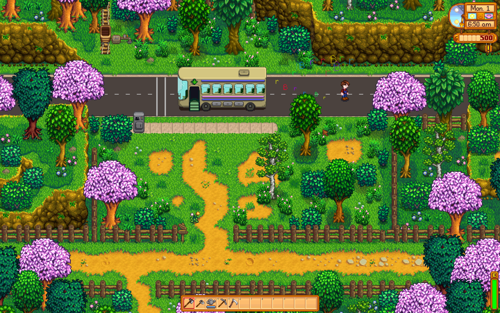

# Eugene's Farm Mod

Welcome! This is the first mod test for Eugene's Farm mods in Stardew Valley. ^.^

---

## Prerequisites

- **Stardew Valley:**  
  A copy of Stardew Valley on Steam  
  [Stardew Valley on Steam](https://store.steampowered.com/app/413150/Stardew_Valley/)

- **SMAPI:**  
  The mod loader for Stardew Valley  
  [SMAPI](https://smapi.io/)

---

## Useful Links

- [Stardew Valley Wiki: Modding Docs](https://stardewvalleywiki.com/Modding:Index)
- [JSON ASSETS](https://www.nexusmods.com/stardewvalley/mods/1720?tab=description) - allows for custom json content. used this for "furniture"
---

## Installing the Mod

1. Build your mod to generate `EugenesFarm.dll`.
2. Move both `EugenesFarm.dll` and `manifest.json` into your Stardew Valley `Mods` folder.
   - Example path:  
     `C:\Program Files (x86)\Steam\steamapps\common\Stardew Valley\Mods\EugenesFarm`
   - its auto doing this for me, but check to ensure its there if its not running properly.
3. Launch Stardew Valley using SMAPI.

## About

Welcome to the official repository for Eugene's Farm mods!

**Current Features:**
- Customizable and an on/off toggle for a walking trail text effect for your character
