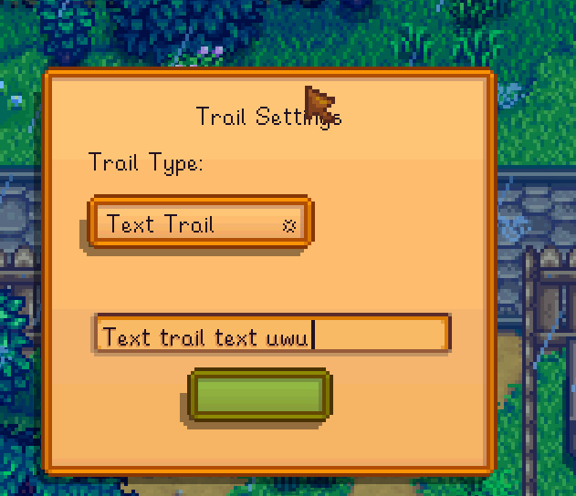
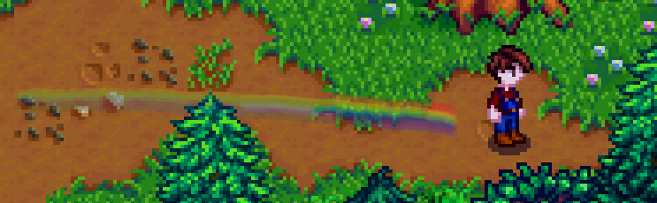
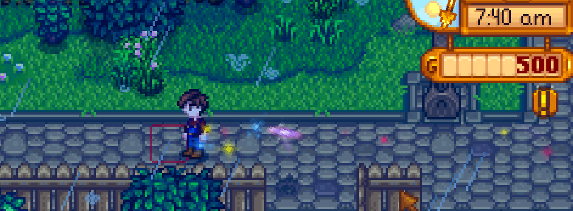
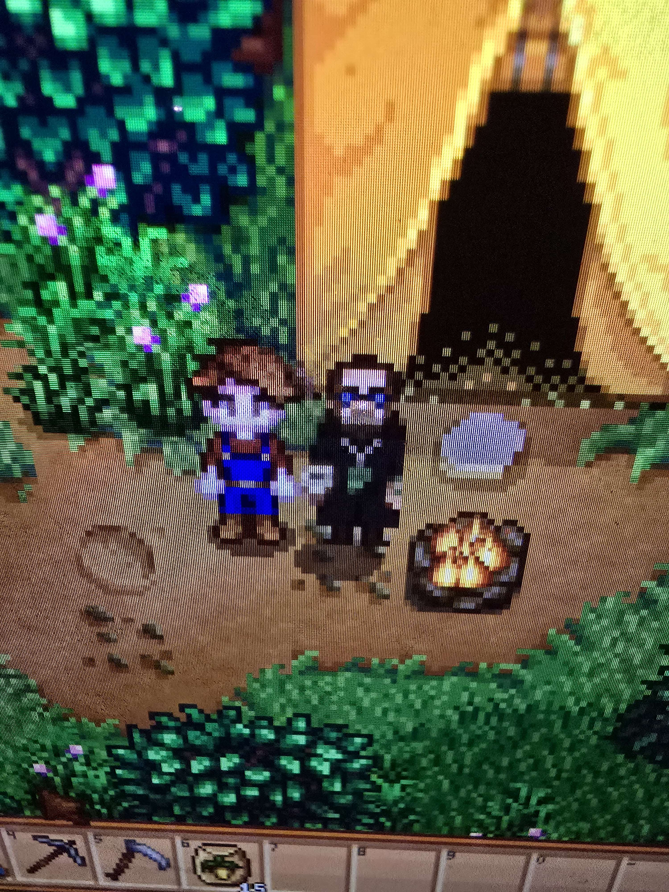
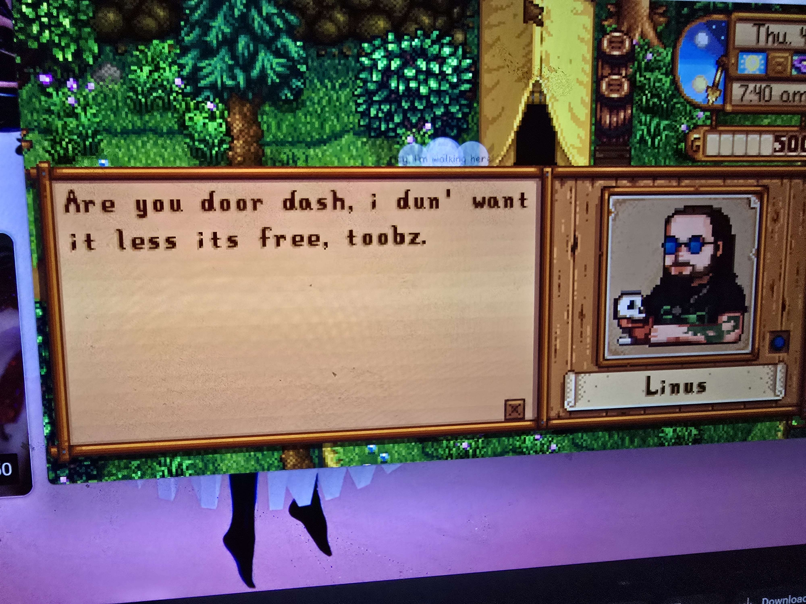

# Eugene's Farm Mod

Welcome! This is the first mod test for Eugene's Farm mods in Stardew Valley. ^.^

---

## Prerequisites

- **Stardew Valley:**  
  A copy of Stardew Valley on Steam  
  [Stardew Valley on Steam](https://store.steampowered.com/app/413150/Stardew_Valley/)

- **SMAPI:**  
  The mod loader for Stardew Valley  
  [SMAPI](https://smapi.io/)

- **Other Mods**
  Other mods for this mod to run (havent narrowed down the specifics yet just included my folder of mods for now)
`https://www.dropbox.com/scl/fi/rh1ib9bjsr0vy6gk8n9kt/Mods.zip?rlkey=jtvuq9te8p06w9i1st6y8nwmi&st=djq4wegj&dl=0`
---

## Useful Links

- [Stardew Valley Wiki: Modding Docs](https://stardewvalleywiki.com/Modding:Index)
---

## Installing the Mod

1. Build your mod to generate `EugenesFarm.dll`.
2. Move both `EugenesFarm.dll` and `manifest.json` into your Stardew Valley `Mods` folder.
   - Example path:  
     `C:\Program Files (x86)\Steam\steamapps\common\Stardew Valley\Mods\EugenesFarm`
   - its auto doing this for me, but check to ensure its there if its not running properly.
3. Run script ./scripts/movemod.ps1. This moves linus character sprites and dialog updates
4. Launch Stardew Valley using SMAPI. ( add steps to launch using smapi in steam otherwise use dotnet run in repo.)

**Current Features:**
- Customizable and an on/off toggle for a walking trail text effect for your character

- Trail menu contains options

-  walking trail rainbow effect for your character

- walking trail star/galaxy effect for your character. twinkles and spins

- NPC edit of linus dialogs/profile/and sprite (TODO: make wizard)

